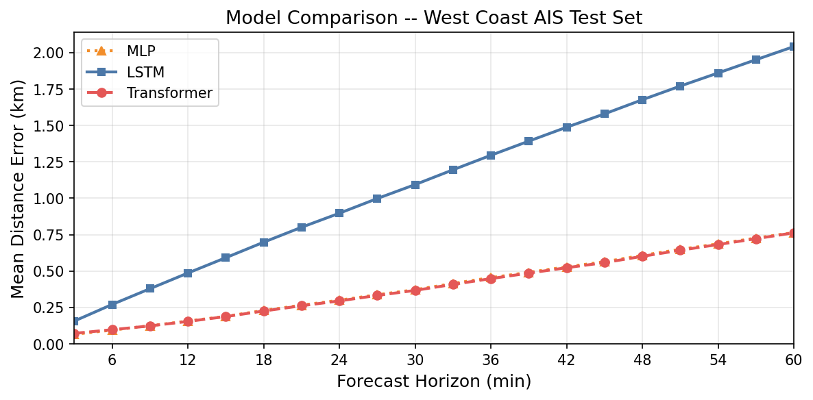

# Vessel Trajectory Prediction Using Deep Learning on AIS Data

**CS 109B Milestone 4, Group 24**  
**Members:** Yuyang Chen, Tim Guo, Lillian Yang, Grace Yang

---

## Overview

This project applies deep learning to predict future vessel trajectories from historical Automatic Identification System (AIS) data. We compare three architectures, an MLP baseline, an LSTM, and a Transformer (Encoder + Query Decoder), on a large-scale West Coast AIS dataset.

---

## Repository Structure

```
cs109b_final_project/
├── cs1090b_ms4_main_group24.ipynb  # Main notebook (run this)
├── dataloader.py                   # PyTorch Dataset & DataLoader
├── best_lstm.pt                    # Saved LSTM checkpoint
├── trained_models/                 # Saved Transformer checkpoints
├── processed/                      # Preprocessed feature stats
└── README.md
```

---

## Requirements

```
numpy >= 1.26
pandas >= 2.2
torch >= 2.10
matplotlib >= 3.8
pyarrow >= 23.0
```

Install with:
```bash
pip install numpy pandas torch matplotlib pyarrow
```

---

## How to Run

### Main Notebook

Open and run `cs1090b_ms4_main_group24.ipynb` in JupyterLab (or Jupyter Notebook). The notebook:

1. **Checks & installs dependencies** (Section 1)
2. **Imports libraries** (Section 2)
3. **Configures paths** — uses `PROJECT_DIR` pointing to this folder (Section 2.2)
4. **Loads preprocessed data** via `dataloader.py` from `splits_West_Coast_3min.parquet` (Section 5)
5. **Defines models** — MLP, LSTM, Transformer (Section 6)
6. **Loads pre-trained checkpoints** (or trains from scratch if missing) (Section 7)
7. **Evaluates all three models** on the test set (Section 8)
8. **Plots Results & Comparison** (Section 9)

All models have saved checkpoints — the notebook will load weights automatically and skip training.

### GPU / CPU

The notebook auto-detects `cuda` and falls back to `cpu`. Training from scratch on CPU will be slow; a GPU is recommended.

---

## Models

| Model | Architecture | Parameters | Mean MDE |
|---|---|---|---|
| MLP | Flatten → Linear(1400→256) → ReLU → Linear(256→128) → ReLU → Linear(128→40) → reshape(B,20,2) | ~74 k | 0.4013 km |
| LSTM | 2-layer LSTM encoder (hidden=256) + autoregressive decoder + LayerNorm + Dropout(0.2) | ~800 k | 1.1312 km |
| Transformer | 4-head, 4-layer encoder + query-decoder with learned future queries | ~varies | 0.3977 km |

---

## Data

The dataset is based on NOAA/USCG AIS broadcast records for the West Coast (3-minute resolution). Preprocessing steps are documented in `generate_trajectories.ipynb`, `merge_monthly.ipynb`, and `make_splits.ipynb`.

**Input features (7 columns per timestep):** lat_rel_km, lon_rel_km, sog_norm, cog_cos, cog_sin, heading_cos, heading_sin

**Prediction target:** delta-lat_km, delta-lon_km (relative displacement over the next 60 minutes)

**Split:** 57.6M train rows / 34.9M val rows, vessel-level assignment (no vessel appears in multiple splits)

---

## Results



- Transformer vs MLP: −0.9% mean MDE (marginal improvement)
- LSTM vs MLP: +181.9% mean MDE (significantly worse due to autoregressive error accumulation)

